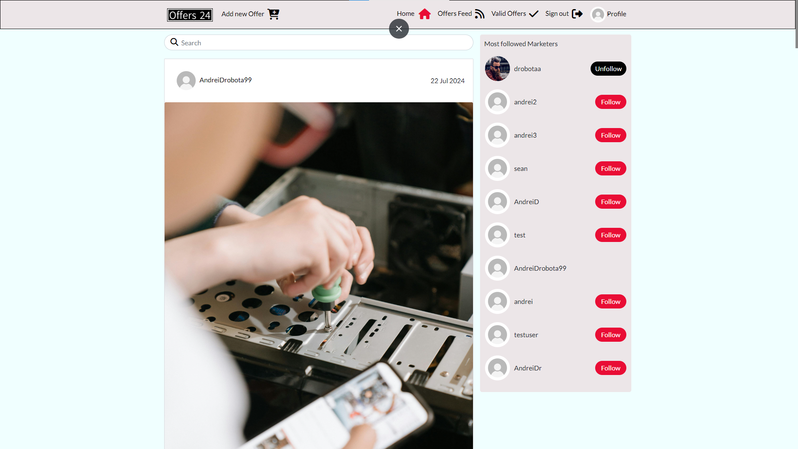

# Offers24 Website

Welcome to **Offers24**, your trusted platform for accessing and sharing the latest offers from various businesses, companies, or even individual users. This project enables users to not only browse offers but also post their own, facilitating a dynamic marketplace of deals and promotions from a wide range of sources.

## Features

### Existing Features

- **Real-Time Offers**: Stay informed with the latest offers worldwide through an up-to-date feed.
- **User-Friendly Interface**: Offers24 prioritizes a seamless and intuitive browsing experience, allowing users to easily navigate and locate offers that are most relevant to them.
- **Community Engagement**: Users can actively participate by commenting on offers, engaging in discussions, and sharing opinions on the latest deals. Additionally, users have the ability to edit or delete their own comments.
- **User Post Capabilities**: Logged-in users can create new offers and track important metrics such as the number of valid offers, comments, and engagement. Users can also modify or delete their offers if necessary.  
- **Follow/Unfollow Functionality**: Logged-in users can follow or unfollow marketers, ensuring that they receive updates on offers from specific marketers in their personalized feed. 
- **Profile Customization**: Users can create and customize either a Marketer Profile or an Offer Catcher Profile. Additionally, users can edit both their profile information and credentials when necessary.
- **Interactive Search**: Offers24 provides a powerful search feature, allowing users to search offers by title, username, or category, ensuring quick and efficient access to relevant content.

### Features left to implement

- **Expiration Attribute**: Introducing a valid_until attribute will enable automatic deletion of posts after a set expiration date, enhancing the timeliness of offers displayed on the platform.

## Testing

### Validator Testing

- The site was validated using the [W3C Markup Validator](https://validator.w3.org/), which returned no errors.
- CSS validation was performed using the [W3C CSS](https://jigsaw.w3.org/css-validator/validator?uri=https%3A%2F%2Fpp5-drobota-bd94aa0a3e49.herokuapp.com%2F&profile=css3svg&usermedium=all&warning=1&vextwarning=&lang=en), confirming that the CSS code complies with web standards.

### Manual Testing

- **Navigation**: All elements in the navigation bar function correctly and display the intended styling. 
- **Button Functionality**: All buttons are properly linked to their corresponding onClick events, with styling applied as intended. 
- **Rendering**: HTML elements render as expected across different pages and devices.
- **CRUD Operations**: The Create, Read, Update, and Delete functionality operates smoothly throughout the platform.

### Automated Testing

- Backend and frontend tests were conducted to ensure the reliability of core functionalities:
  - **Backend Testing**: Focused primarily on the Post/Offer functionality, ensuring all tests passed successfully.
  - **Frontend Testing**: Concentrated on the rendering of the navigation bar for both logged-in and logged-out users, along with link verification.

### Known Issues

- **Follow/Unfollow Button**: The Follow/Unfollow button does not update its style immediately after being clicked. The style change only takes effect once the user clicks outside the button. [!alt Button bug](./staticfiles/build/static/images/buttonbug.png)

## Used Libraries

- **React Bootstrap**: This project utilizes [React Bootstrap](https://react-bootstrap-v4.netlify.app/). for its pre-designed components and consistent styling, streamlining the development process and ensuring adherence to Bootstrap's design principles.
- **Axios**: The [Axios](https://axios-http.com/docs/intro) library was used to handle HTTP requests. Axios simplifies the process of making API requests and supports promises for managing asynchronous operations, while also automatically handling JSON data transformation.

## Reusable Components

- To promote code maintainability and cleanliness, several reusable components were developed:
 - **Navbar Component**: This component is responsible for displaying links consistently across all pages.
 - **DropDown Component**: Used to facilitate CRUD operations with minimal navigation.
 - **ResourceA Component**: This component displays a spinner or a message when other resources are loading, ensuring a smooth user experience. 

## Deployment

- **Frontend Deployment**:
  The frontend of the Offers24 platform was developed using React and deployed via Heroku. The deployment process involved:
    - Navigating to the Heroku dashboard and clicking on "New."
    - Selecting the deployment method via GitHub and connecting the repository.
    - Ensuring that the frontend project is built using the appropriate environment variables and settings, such as API endpoints and authentication configurations.
    - Deploying the frontend manually from the main branch or enabling automatic deployment for continuous integration.

- **Backend Deployment**:
  The backend of the Offers24 platform, developed with Django, was also deployed on Heroku using the following steps:
    - Setting up the Heroku environment for Django, including the necessary Procfile and requirements.txt to ensure the correct runtime environment.
    - Connecting the backend repository to Heroku.
    - Configuring environment variables for database connections, API keys, and other sensitive credentials through Heroku’s settings.
    - Using CodeInstitute Database creator as the database service in the Heroku environment.
    - Deploying the backend from the main branch, ensuring that migrations were applied, and the application was ready for production use.

## Credits

- [Code Institute Moments Project](https://learn.codeinstitute.net/courses/course-v1:CodeInstitute+RA101+1/courseware/70a8c55db0504bbdb5bcc3bfcf580080/953cd4e5015f483bb05263db3e740e19/)
- [Cloudinary](https://console.cloudinary.com/)
- [Font Awesome](https://fontawesome.com/)
- [Bootstrap React](https://react-bootstrap-v4.netlify.app/)
