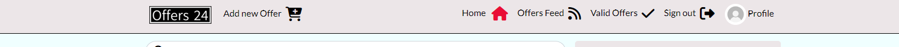

# Offers24 Website

**Welcome to Offers24 website, your go-to source for the latest offers from various shops/business or even indivuduals!

## Features

### Existing Features

- Up-to-Date Offers: Get the latest offers from around the globe, keeping you informed.
- Our website offers an intuitive and user-friendly experience, ensuring you can easily navigate through offers and find the offer that matters to you.
- Join the conversation! Engage with fellow tech enthusiasts through comments and discussions, sharing your thoughts and opinions on the hottest and latest Offers. Aswell as editing or deleting your comments.
- As a Logged in User, I can Post a new Offer, being able to track its Valid counter, Comment Counter, aswell as editing or deleting it.  
- As a Logged in User, I can Follow/ Unfollow Marketers, in order to be able to see their Offers in my feed 
- You can create your Marketer Profile, or just a Offer Catcher Profile, and Edit yout Profile aswell as Credentials. 
- Interactive Search. You can search an Offer, after its Title, Username, or even category.

### Features left to implement

- A valid_until attribute, in order to make the posts auto-delete after a given date.

## Testing

### Validator Testing

- Errors returned from [W3C Validator](https://validator.w3.org/)
- No error returned from [W3C CSS](https://jigsaw.w3.org/css-validator/validator?uri=https%3A%2F%2Fpp5-drobota-bd94aa0a3e49.herokuapp.com%2F&profile=css3svg&usermedium=all&warning=1&vextwarning=&lang=en)

### Manual Testing

- All the Elements in the nav bar work aswell as the styling. 
- All the Button Elements are properly linked up with their respective onClick attributes, the styling works as intended 
- All the Html is rendering properly
- All the CRUD Functionality works as intended.

### Automated Testing

- No errors retuned from the automated tests included in the BackEnd aswell as in FrontEnd.
  - In BackEnd we tested, mainly the Post/Offer side, all the tests Passed
  - In FrontEnd we tested, mainly the NavBar rendering For Logged In, respectively Logged out User, and aswell as Links

### Unfixed Bugs

- The button for Follow/Unfollow does not take his style untill you click outside of it [!alt Button bug](./staticfiles/build/static/images/buttonbug.png)

## Used Libraries

- React Bootstrap [React Bootstrap](https://react-bootstrap-v4.netlify.app/). We chose to use React Bootstrap for our project to leverage its pre-designed components and styles that are consistent with Bootstrap's established design system.
- Axios. [Axios](https://axios-http.com/docs/intro) We chose to use Axios for handling HTTP requests in our project due to its simplicity and powerful features. Axios provides a clean and intuitive API for making requests, supports promises which make it easier to handle asynchronous operations, and automatically transforms JSON data.

## Reusable Components

- We chose to have Reusable Components, in order to have a clean approach in most of the elements.
 - Navbar component. To display the links on every page
 - DropDown component. To be able to help the users performing crud with minimal navigation
 - ResourceA component. To be able to display a Spinner or a message, when another resources are loading, or a message needs to be displayed 

## Deployment

- This app was deployed to Heroku App. Steps:
  - In the heroku panel, click New
  - Deployment method via GitHub
  - Connect your project repository via Heroku
  - Go to Settings:
    - Write your config vars
  - For Manual Deploy, select main branch

## Credits

- [Code Institute Moments Project](https://learn.codeinstitute.net/courses/course-v1:CodeInstitute+RA101+1/courseware/70a8c55db0504bbdb5bcc3bfcf580080/953cd4e5015f483bb05263db3e740e19/)
- [Cloudinary](https://console.cloudinary.com/)
- [Font Awesome](https://fontawesome.com/)
- [Bootstrap React](https://react-bootstrap-v4.netlify.app/)
